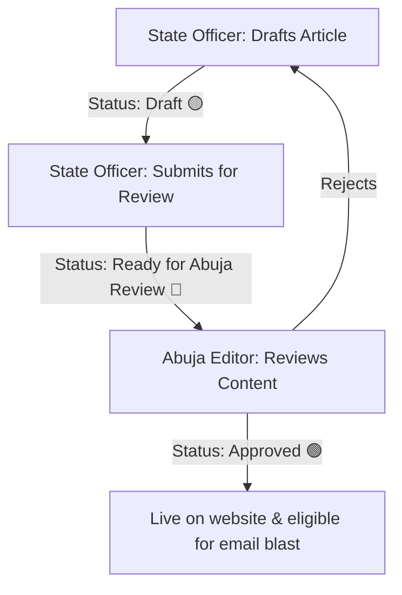

# SURWASH Newsletter Platform Operations Manual

Welcome to the operations manual for the SURWASH "Edition + Theme" Newsletter Archive and Publishing Platform. This document is designed for the communications, content, and developer teams to understand, operate, and manage the platform independently.

---

## 📋 Table of Contents
1. [Platform Architecture & URLs](#1-platform-architecture--urls)
2. [User Roles & Permissions Gate](#2-user-roles--permissions-gate)
3. [Editorial & Publishing Workflow](#3-editorial--publishing-workflow)
4. [Newsletter Content Structure](#4-newsletter-content-structure)
5. [Bulk Email Campaigns (Email Blasts)](#5-bulk-email-campaigns-email-blasts)
6. [Analytics & Telemetry Tracking](#6-analytics--telemetry-tracking)
7. [Technical Maintenance & Operations](#7-technical-maintenance--operations)

---

## 1. Platform Architecture & URLs

The platform uses a Next.js frontend with Sanity CMS, mapped to the custom domain `https://newsletter.surwash.ng`.

*   **Newsletter Feed (Homepage):** [https://newsletter.surwash.ng/](https://newsletter.surwash.ng/)
    *   *Renders all historical newsletter editions chronologically.*
*   **Editor Portal / Studio Login:** [https://newsletter.surwash.ng/login](https://newsletter.surwash.ng/login)
    *   *Where State Officers and Abuja Editors log in to manage content.*
*   **Sitemap:** [https://newsletter.surwash.ng/sitemap.xml](https://newsletter.surwash.ng/sitemap.xml)
    *   *Generated dynamically to optimize SEO indexability.*

---

## 2. User Roles & Permissions Gate

The project runs on a free-tier Sanity plan. To allow team members to edit and create drafts, they must be assigned correct roles.

### User Roles in the Sanity Console
*   **Administrator (Required for all Writers/Editors):** Assign this role to all **State Communication Officers** and **Abuja Editors**. They must have write permissions to create drafts in the Studio dashboard.
*   **Viewer:** Read-only access. Used only for team members who need to view drafts without editing.

### 🛡️ Code-Level Security Gate (Virtual Permissions)
To prevent unauthorized publishes, we implemented a custom authorization gate directly in the schema code:
*   **State Officers (Draft & Review Only):** Can create articles, edit draft text, upload images, and set the status to `"Ready for Abuja Review"`. If they attempt to mark an article as `"Approved"`, the Studio blocks them and prevents saving.
*   **Whitelisted Abuja Approvers:** Only the following three emails are whitelisted to change status to `"Approved"` and make articles visible on the public website:
    1.  `felicia.ngajiusibe@gmail.com`
    2.  `tmlabs.takeoutmedia@gmail.com`
    3.  `chukajagu@gmail.com`

---

## 3. Editorial & Publishing Workflow

The platform enforces a structured "Traffic-Light" status workflow using visual status badges in the Studio sidebar:



### Step 1: Drafting (State Officers)
1.  Log in at [https://newsletter.surwash.ng/login](https://newsletter.surwash.ng/login) using your Google or Email/Password account.
2.  In the sidebar, click the **Articles by State** folder and click your designated state (e.g., *Plateau State*).
3.  Click the plus sign `+` to create a new **Newsletter Article**.
4.  Follow the rules shown in the **SURWASH Comms Publishing Rules** panel at the top of the editor:
    *   Link the article to its corresponding **Newsletter Edition**.
    *   Ensure the **State Scope** matches your state.
    *   Ensure every image has a descriptive **Alt Text** and **Caption**.
5.  Keep the **Approval Status** set to **Draft** (🟡 Yellow Badge).

### Step 2: Submission (State Officers)
*   When finished writing and formatting, change the **Approval Status** to **Ready for Abuja Review** (🔵 Blue Badge).

### Step 3: Approval & Publishing (Abuja Editors)
1.  Open the article from the sidebar under the **Articles by State** list.
2.  Review text, layout, and images.
3.  Change the **Approval Status** to **Approved by Head of Comms** (🟢 Green Badge).
4.  Click the green **Publish** button at the bottom right.
    *   *Once published, the article will automatically appear on the live feed.*
    *   *Approved articles are locked to prevent further editing by State Officers.*

---

## 4. Newsletter Content Structure

Newsletter articles and editions are linked hierarchically:

### Newsletter Edition Document
Represents the publication period (e.g., *"March – June 2026"*).
*   **Title:** Name of the edition (e.g., "March – June 2026").
*   **Theme:** The focus of this edition (e.g., "WASH Infrastructure Improvements").
*   **Slug:** URL path segment (e.g., `march-june-2026`).
*   **Edition Number:** Index number (e.g., `1`).
*   **Telemetry Fields:** Read-only analytics counters updated by incoming webhooks (Delivered, Opened, Clicks, Bounces).

### Newsletter Article Document
Represents the individual stories and news.
*   **Title & Slug:** Dynamic article path.
*   **Edition:** Reference linking this article to a **Newsletter Edition** document.
*   **State Scope:** Select from Federal, Abuja, Gombe, Katsina, Plateau, etc.
*   **Content Block:** Rich text compiler supporting inline images with native aspect ratio scaling and captions.

---

## 5. Bulk Email Campaigns (Email Blasts)

The platform supports sending full-fidelity HTML newsletters to email subscribers via the **Resend** engine, triggered directly from Sanity.

### How to Send an Email Blast:
1.  In the Studio sidebar, click **Email Blasts** and create a new document.
2.  Give it a **Campaign Title** and choose the **Newsletter Edition** you want to blast.
3.  Choose the **Target Audience** (e.g., All Subscribers, Federal Comms, or state-specific segments).
4.  **Preview Email:** Click the **Preview Email Link** shown in the editor to inspect the generated HTML layout before sending.
5.  **Send Blast:** In the bottom-right actions list, click **Send Email Blast** and verify the handshake prompt.
    *   *The serverless API compiles all Approved articles inside the chosen edition, packages them into a clean responsive layout, and triggers delivery to your Resend subscribers list.*
    *   *Each email contains tracking pixels and links containing tracking IDs.*

---

## 6. Analytics & Telemetry Tracking

When emails are blasted, the system automatically tracks interaction telemetry:

1.  **Delivery, Opens, and Clicks:** The email template contains tracking nodes.
2.  **Telemetry Endpoint:** The email delivery system sends events back to the webhook receiver at `/api/email-webhooks`.
3.  **Signature Verification:** The webhook uses HMAC-SHA256 signature verification via the `EMAIL_WEBHOOK_SECRET` environment variable to ensure safety against falsified telemetry reports.
4.  **Database Updates:** Valid webhooks trigger transaction patches that increment the counters (`emailsDelivered`, `emailsOpened`, `linkClicks`, `bounces`) on the target **Newsletter Edition** document in Sanity.

---

## 7. Technical Maintenance & Operations

For developers maintaining the platform, the following utilities are available:

### ⚡ ISR Revalidation (Cache Clearing)
The site uses Incremental Static Regeneration (ISR) to load instantaneously. If you publish content and it doesn't appear on the live site immediately, trigger a cache revalidation:
*   Make a GET request to:
    `https://newsletter.surwash.ng/api/revalidate?secret=YOUR_REVALIDATION_SECRET&tag=newsletter`
*   Replace `YOUR_REVALIDATION_SECRET` with the secret configured in your `.env.local` file.

### 🧹 DB Migration Scripts
Located in the `scripts/` directory:
*   `seed-newsletter.mjs`: Populates dummy newsletters and mock editions for staging test cases.
*   `delete-comments.mjs`: Removes legacy comment nodes from the database.
*   `approve-all-posts.mjs`: Script to bulk-approve all existing articles in the database. Run via:
    ```bash
    node scripts/approve-all-posts.mjs
    ```
